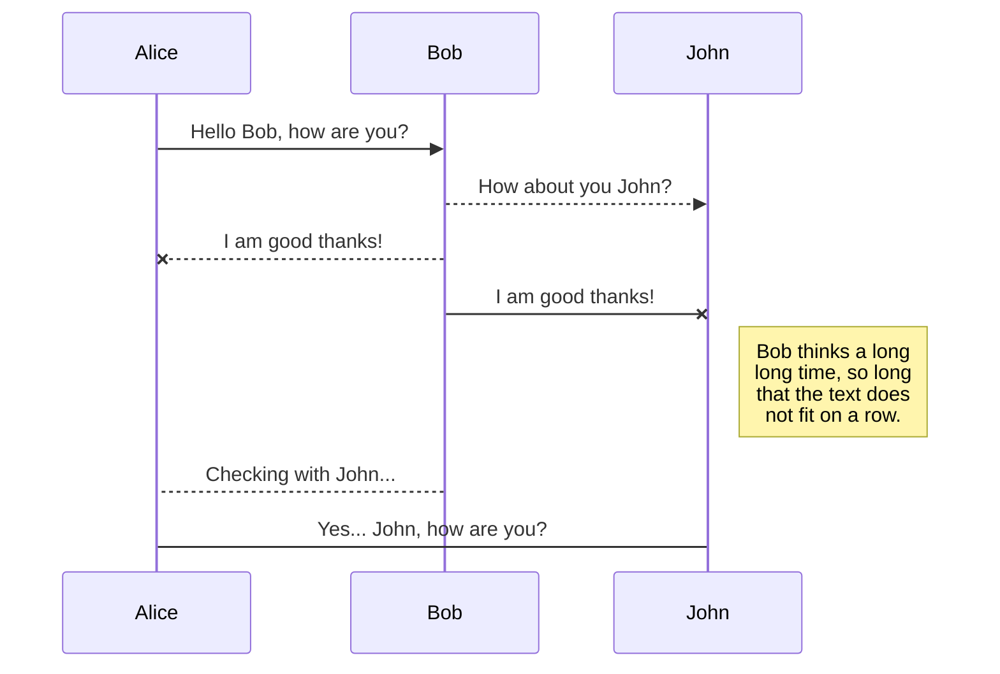
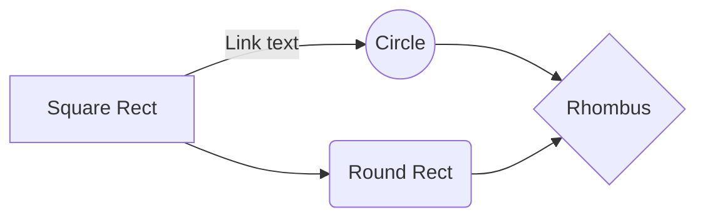

### Sources of information to see interactions between particle physics
1. Scattering events: a particle is fire at another and the angle of inflection is recorded
2. decays: a particle spontaneously disintegrates and the debris are examined
3. bound states: Two or more particles stick togethe, and the properties of the composite object are studied.

### Physics needed
when you are dealing with small objects, like atoms or electrons, you have to make the transition from classical mechanics to quantum mechanics, and when you have objects that travel very fast you have to use special relativity, the elementary particles are booth, so you need a combination of these theories, that combination is called **Quantum field theory**

some of the implications are that for example the mass is not not conserved as energy and momentum does, so you have interactions where the mass is different at the beginning and at the end, or that you can not assume the result you will get after an interaction knowing the initial states, rather you will have a probability this state.

### Sources of elementary Particles
1. Cosmic Rays: from outer space, high-energy particles arrive constantly, probably originated in supernovas or active galactic nucleus (this subject is still an area of research). They hit atoms in the upper atmosphere and produce showers of secondary particles, which rasin down on us all the time, despite the fact that the energies of these particles are far greater than we produce in the laboratory, the rate at they strike a detector is very low, and of course they are completely uncontrollable. 
2.  Nuclear Reactors: The desintegration of a radioactive nucleous produce a variety of particles like alpha, beta and gama rays, which are basicly neutrons, protons and photons.
3. Particle acelerators: you acelerate electrons or protons to a high speed and them smash tehm in oposite directions inside a elavorate detector to see what is produced after the collision.

In general, the heavier the particle you want to produce, the higher must be the energy of the collision.

### History of particles
1. Electron . Thomson
2. Atom Nucleus. Proton Rutherford
3.  Neutron
4.  Photon: in quantum field theory, the fields are quantized and the interactions of the forces are constant exchange of some particles
5.  Meson: what holds the nucleus together? yukawa calculates an intermediate masive particle (meson) to the exchange particle that allows the strong force, and then evidence was seen in experiments with cosmic ray particles.
6. Antiparticles: as a consequence of  the relativistic theory, the energy of free electrons cloul be negative, which after many interpretation attempts, stuckleberg and feynman provided one in wich the negative energy solutions are possitive energy states of another particle, the positron, or the electron antiparticle. It turns out that as a consecuance of thew quantum field theory, for every particle there must exist a corresponding antiparticle with the same mas but opposite electric charge or lepton number, and those antiparticles can't exist for long, because they can't coexist with their opposites, if a particle meets its antiparticle they annihilate, and since our universe is made of "ordinary mater". and those antiparticles can't exist for long, because they can't coexist with their opposites. When an antiparticle is generated, it quickly finds its opposite and both disappear. because our universe is made up of normative matter, this is still an open question, but for now observations suggest that it is a historical accident that occurred during the initial stages of the creation of the universe after the big bang.
7. Neutrinos:  As a consequence of the study of beta decay, where a nuclear nucleus decays into a 
8. 
9. 

# Welcome to StackEdit!

Hi! I'm your first Markdown file in **StackEdit**. If you want to learn about StackEdit, you can read me. If you want to play with Markdown, you can edit me. Once you have finished with me, you can create new files by opening the **file explorer** on the left corner of the navigation bar.

# Files

StackEdit stores your files in your browser, which means all your files are automatically saved locally and are accessible **offline!**

## Create files and folders

The file explorer is accessible using the button in left corner of the navigation bar. You can create a new file by clicking the **New file** button in the file explorer. You can also create folders by clicking the **New folder** button.

## Switch to another file

All your files are listed in the file explorer. You can switch from one to another by clicking a file in the list.

## Rename a file

You can rename the current file by clicking the file name in the navigation bar or by clicking the **Rename** button in the file explorer.

## Delete a file

You can delete the current file by clicking the **Remove** button in the file explorer. The file will be moved into the **Trash** folder and automatically deleted after 7 days of inactivity.

## Export a file

enter code hereYou can export the current file by clicking **Export to disk** in the menu. You can choose to export the file as plain Markdown, as HTML using a Handlebars template or as a PDF.

# Synchronization

Synchronization is one of the biggest features of StackEdit. It enables you to synchronize any file in your workspace with other files stored in your **Google Drive**, your **Dropbox** and your **GitHub** accounts. This allows you to keep writing on other devices, collaborate with people you share the file with, integrate easily into your workflow... The synchronization mechanism takes place every minute in the background, downloading, merging, and uploading file modifications.

There are two types of synchronization and they can complement each other:

- The workspace synchronization will sync all your files, folders and settings automatically. This will allow you to fetch your workspace on any other device.
	> To start syncing your workspace, just sign in with Google in the menu.

- The file synchronization will keep one file of the workspace synced with one or multiple files in **Google Drive**, **Dropbox** or **GitHub**.
	> Before starting to sync files, you must link an account in the **Synchronize** sub-menu.

## Open a file

You can open a file from **Google Drive**, **Dropbox** or **GitHub** by opening the **Synchronize** sub-menu and clicking **Open from**. Once opened in the workspace, any modification in the file will be automatically synced.

## Save a file

You can save any file of the workspace to **Google Drive**, **Dropbox** or **GitHub** by opening the **Synchronize** sub-menu and clicking **Save on**. Even if a file in the workspace is already synced, you can save it to another location. StackEdit can sync one file with multiple locations and accounts.

## Synchronize a file

Once your file is linked to a synchronized location, StackEdit will periodically synchronize it by downloading/uploading any modification. A merge will be performed if necessary and conflicts will be resolved.

If you just have modified your file and you want to force syncing, click the **Synchronize now** button in the navigation bar.

> **Note:** The **Synchronize now** button is disabled if you have no file to synchronize.

## Manage file synchronization

Since one file can be synced with multiple locations, you can list and manage synchronized locations by clicking **File synchronization** in the **Synchronize** sub-menu. This allows you to list and remove synchronized locations that are linked to your file.

# Publication

Publishing in StackEdit makes it simple for you to publish online your files. Once you're happy with a file, you can publish it to different hosting platforms like **Blogger**, **Dropbox**, **Gist**, **GitHub**, **Google Drive**, **WordPress** and **Zendesk**. With [Handlebars templates](http://handlebarsjs.com/), you have full control over what you export.

> Before starting to publish, you must link an account in the **Publish** sub-menu.

## Publish a File

You can publish your file by opening the **Publish** sub-menu and by clicking **Publish to**. For some locations, you can choose between the following formats:

- Markdown: publish the Markdown text on a website that can interpret it (**GitHub** for instance),
- HTML: publish the file converted to HTML via a Handlebars template (on a blog for example).

## Update a publication

After publishing, StackEdit keeps your file linked to that publication which makes it easy for you to re-publish it. Once you have modified your file and you want to update your publication, click on the **Publish now** button in the navigation bar.

> **Note:** The **Publish now** button is disabled if your file has not been published yet.

## Manage file publication

Since one file can be published to multiple locations, you can list and manage publish locations by clicking **File publication** in the **Publish** sub-menu. This allows you to list and remove publication locations that are linked to your file.

# Markdown extensions

StackEdit extends the standard Markdown syntax by adding extra **Markdown extensions**, providing you with some nice features.

> **ProTip:** You can disable any **Markdown extension** in the **File properties** dialog.

## SmartyPants

SmartyPants converts ASCII punctuation characters into "smart" typographic punctuation HTML entities. For example:

|                |ASCII                          |HTML                         |
|----------------|-------------------------------|-----------------------------|
|Single backticks|`'Isn't this fun?'`            |'Isn't this fun?'            |
|Quotes          |`"Isn't this fun?"`            |"Isn't this fun?"            |
|Dashes          |`-- is en-dash, --- is em-dash`|-- is en-dash, --- is em-dash|

## KaTeX

You can render LaTeX mathematical expressions using [KaTeX](https://khan.github.io/KaTeX/):

The *Gamma function* satisfying $\Gamma(n) = (n-1)!\quad\forall n\in\mathbb N$ is via the Euler integral

$$
\Gamma(z) = \int_0^\infty t^{z-1}e^{-t}dt\,.
$$

> You can find more information about **LaTeX** mathematical expressions [here](http://meta.math.stackexchange.com/questions/5020/mathjax-basic-tutorial-and-quick-reference).

## UML diagrams

You can render UML diagrams using [Mermaid](https://mermaidjs.github.io/). For example, this will produce a sequence diagram:

And this will produce a flow chart:

<!--stackedit_data:
eyJoaXN0b3J5IjpbOTQ0MTUwNDg1LC0zMDkwNjM3MTYsMTkxOT
U2OTg3NiwtMTYxMjQ0ODUxMywxMTA1NTMzNzMxLDIyMTA3NTI4
MywxNjQ1Mzk0MDYwLC0xOTEyNjYyNzIyXX0=
-->