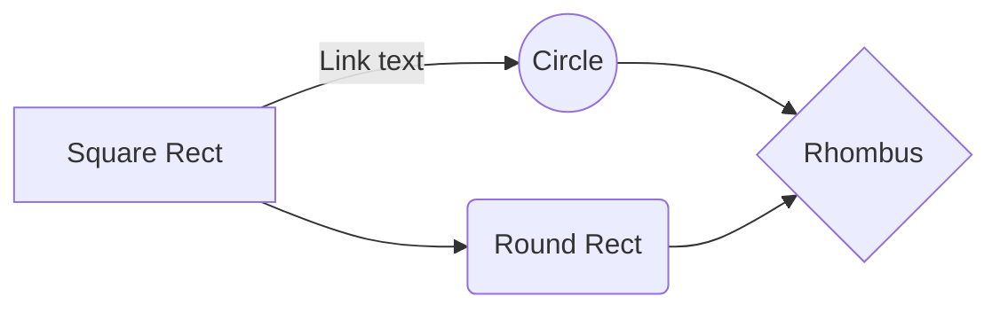

### Sources of information to see interactions between particle physics
1. Scattering events: a particle is fire at another and the angle of inflection is recorded
2. decays: a particle spontaneously disintegrates and the debris are examined
3. bound states: Two or more particles stick together, and the properties of the composite object are studied.

### Physics needed
when you are dealing with small objects, like atoms or electrons, you have to make the transition from classical mechanics to quantum mechanics, and when you have objects that travel very fast you have to use special relativity, the elementary particles are booth, so you need a combination of these theories, that combination is called **Quantum field theory**

some of the implications are that for example the mass is not not conserved as energy and momentum does, so you have interactions where the mass is different at the beginning and at the end, or that you can not assume the result you will get after an interaction knowing the initial states, rather you will have a probability this state.

### Sources of elementary Particles
1. Cosmic Rays: from outer space, high-energy particles arrive constantly, probably originated in supernovas or active galactic nucleus (this subject is still an area of research). They hit atoms in the upper atmosphere and produce showers of secondary particles, which rasin down on us all the time, despite the fact that the energies of these particles are far greater than we produce in the laboratory, the rate at they strike a detector is very low, and of course they are completely uncontrollable. 
2.  Nuclear Reactors: The desintegration of a radioactive nucleous produce a variety of particles like alpha, beta and gama rays, which are basicly neutrons, protons and photons.
3. Particle acelerators: you acelerate electrons or protons to a high speed and them smash tehm in oposite directions inside a elavorate detector to see what is produced after the collision.

In general, the heavier the particle you want to produce, the higher must be the energy of the collision.

## The Standard model
What is matter made of?, What are the basic building blocks of the universe that form all the atoms, molecules, proteins, planets, stars, and the life itself?. Particle physics studies this question, and within his studies was developed the **standard model**, the physical theory that describes the properties and behaviors of particles at a subatomic scale. 

### Some basic rules to understand the standard model

### A very brief history of particle physics 

1. Atoms: in the 17th century, it was well accepted that chemical elements were made up of *indivisible* components called atoms, which were electrically neutral or could have charge (ions).  But then in the year 1897, J.J.Thomson analyzed the curvature of cathodic rays subjected to a magnetic field, and he realized that these rays had to be formed by negative charged corpuscles, but that they were not ions, because the curvature of the trajectory showed that the mass had to be very inferior to the mass of an atom. The conclusion was that the atom was certainly not an elemental block, and was composed of other particles, and in the experiment it was detaching one of these, the **electron**.  But if this particle had a negative charge, the remaining part of the atoms should have a positive charge.  Ernest Rutherford would demonstrate with his scattering experiment that indeed it was other component with positive charge concentrated in a tiny core at the center of the atom, that contained almost the entire mass of it, the nucleus of the atom made up of positive charges,  the **protons**. The first description of the lightest atom, hydrogen, was the union of a proton and an electron, and using this model and the, at that time, new quantum theory, Niels  Bohr calculated the hydrogen spectrum, and the result was so accurate in comparison with the experimental results, that it was natural to assume that this model of the atom was the right one, and therefore that heavier atoms were composed of two or more protons bound together with the same number of electrons. However, the next heavier atom (helium),  despite having two electrons,  weighs four times more than hydrogen, and lithium with three electrons, seven times the weight of hydrogen and so on. The problem was solved with the discovery of the **neutron**, a particle almost identical to the proton but ellectrically neutral, which was also inside the nucleus of the atom. In this way the modern conception of the atom and its components (nucleus of protons and neutrons surrounded by electrons ) that we have today was arrived, but of course it wasn't the end of the story.

2.  Photons: In 1900 Max Plank was able to obtain a formula to describe the electromagnetic radiation emitted by a hot object, proposing that this radiation was quantized in small energy packages (the birth of quantum mechanics). Five years later, Albert Einstein argued that the quantization was a feature of the electromagnetic field itself, and proposed a formula to explain the photoelectric effect,  in which a *light quantum* hits an electron in the surface, giving up its energy, and then the exited electron breaks through the metal surface. The proposal of corpuscles of light was not very accepted at the time, but the corroborations in the laboratory of the photoelectric effect and the experiment carried out in 1923 by Arthur Compton, in which light skaters off a particle, evidenced that light behaves as a particle, on the subatomic scale. This particle was called **photon**.

To understand a little more the fact that the quantization is a feature of the electromagnetic field, it is necessary to address the physical theories necessary to analyze the interactions of these particles.

3. Physics needed: 
when you are dealing with small objects, like atoms or electrons, you have to make the transition from classical mechanics to quantum mechanics, and when you have objects that travel very fast you have to use special relativity, the elementary particles are booth, so you need a combination of these theories, that combination is called **Quantum field theory**.   This combination has certain important implications, for example, energy and momentum are always conserved, but the mass  (mass at rest) is not, and it is possible to have a decay A -> B + C, in which the sum of mass B and C is greater than the mass of A. This is a direct consequence of the relativistic theory. Another implication is that physical systems are described by a wave function, and physical processes consist of transitions from one state to another, and these transitions are not fully determined by the initial conditions, instead the probability for a given transition to occur is calculated.

In this theory, the photon offer a whole new perspective on electromagnetic interactions, the electrical repulsion or attraction is no longer attributed to the magnetic field, in the quantum field theory the electric field is quantized in the form of photons, and the electric interactions are described as the constant exchange of these, which carry the *information* of repullsion or attraction. For instance, in the case of the repulsion of two electrons, we can imagine the interaction like a stream of photons, which is emitted and absorbed by both of the electrons. In this picture is more evident that the quantization is a feature of the electromagnetic field itself.
 
3.  Mesons: 
If the nucleus of the atom was concentrated in a small region, and this was composed by neutrons and protons, what keeps these protons (electrically charged) together with neutrons, and prevents them from repelling one another violently?. Hideki Yukawa proposed in 1934, that there should be a force that would attract neutrons and protons together, and that this force should be stronger than the electrical repulsion of protons, but that it should have a very small range, because otherwise we would see its effects beyond the atom.  

Yukawa also thought that this force (like the electromagnetic) should be quantized, and that there should be some particle in charge of mediating it. Taking into account the short range of this force (about the radius of the core), he estimated that its mass should be nearly 6 times the mass of the proton, y fue llamada **meson**, 

 yukawa calculates an intermediate masive particle (meson) to the exchange particle that allows the strong force, and then evidence was seen in experiments with cosmic ray particles.

5. Antiparticles: as a consequence of  the relativistic theory, the energy of free electrons could be negative, which after many interpretation attempts, stuckleberg and feynman provided one in wich the negative energy solutions are positive energy states of another particle, the positron, or the electron antiparticle. It turns out that as a consequence of the quantum field theory, for every particle there must exist a corresponding antiparticle with the same mas but opposite electric charge or lepton number, and those antiparticles can't exist for long, because they can't coexist with their opposites, if a particle meets its antiparticle they annihilate, and since our universe is made of "ordinary mater". and those antiparticles can't exist for long, because they can't coexist with their opposites. When an antiparticle is generated, it quickly finds its opposite and both disappear. because our universe is made up of normative matter, this is still an open question, but for now observations suggest that it is a historical accident that occurred during the initial stages of the creation of the universe after the big bang.
6. Mesons: pi and muon, page 19
7. Neutrinos:  in the first half of the last century, the **beta decay**, where a radioactive nucleus decays into other slightly lighter with the emission of one electron, was a well-studied phenomenon, however the experimental measures showed a discordance with the conservation of energy,  the electron had less energy than expected. To explain this result, Wolfgang Pauli proposed that another particle was emitted along with the electron, a particulate that due to the conservation of the charge, it had to be electrically neutral, and due to conservation of energy extremely light. 
8. 
9. 

# Welcome to StackEdit!

Hi! I'm your first Markdown file in **StackEdit**. If you want to learn about StackEdit, you can read me. If you want to play with Markdown, you can edit me. Once you have finished with me, you can create new files by opening the **file explorer** on the left corner of the navigation bar.

# Files

StackEdit stores your files in your browser, which means all your files are automatically saved locally and are accessible **offline!**

## Create files and folders

The file explorer is accessible using the button in left corner of the navigation bar. You can create a new file by clicking the **New file** button in the file explorer. You can also create folders by clicking the **New folder** button.

## Switch to another file

All your files are listed in the file explorer. You can switch from one to another by clicking a file in the list.

## Rename a file

You can rename the current file by clicking the file name in the navigation bar or by clicking the **Rename** button in the file explorer.

## Delete a file

You can delete the current file by clicking the **Remove** button in the file explorer. The file will be moved into the **Trash** folder and automatically deleted after 7 days of inactivity.

## Export a file

enter code hereYou can export the current file by clicking **Export to disk** in the menu. You can choose to export the file as plain Markdown, as HTML using a Handlebars template or as a PDF.

# Synchronization

Synchronization is one of the biggest features of StackEdit. It enables you to synchronize any file in your workspace with other files stored in your **Google Drive**, your **Dropbox** and your **GitHub** accounts. This allows you to keep writing on other devices, collaborate with people you share the file with, integrate easily into your workflow... The synchronization mechanism takes place every minute in the background, downloading, merging, and uploading file modifications.

There are two types of synchronization and they can complement each other:

- The workspace synchronization will sync all your files, folders and settings automatically. This will allow you to fetch your workspace on any other device.
	> To start syncing your workspace, just sign in with Google in the menu.

- The file synchronization will keep one file of the workspace synced with one or multiple files in **Google Drive**, **Dropbox** or **GitHub**.
	> Before starting to sync files, you must link an account in the **Synchronize** sub-menu.

## Open a file

You can open a file from **Google Drive**, **Dropbox** or **GitHub** by opening the **Synchronize** sub-menu and clicking **Open from**. Once opened in the workspace, any modification in the file will be automatically synced.

## Save a file

You can save any file of the workspace to **Google Drive**, **Dropbox** or **GitHub** by opening the **Synchronize** sub-menu and clicking **Save on**. Even if a file in the workspace is already synced, you can save it to another location. StackEdit can sync one file with multiple locations and accounts.

## Synchronize a file

Once your file is linked to a synchronized location, StackEdit will periodically synchronize it by downloading/uploading any modification. A merge will be performed if necessary and conflicts will be resolved.

If you just have modified your file and you want to force syncing, click the **Synchronize now** button in the navigation bar.

> **Note:** The **Synchronize now** button is disabled if you have no file to synchronize.

## Manage file synchronization

Since one file can be synced with multiple locations, you can list and manage synchronized locations by clicking **File synchronization** in the **Synchronize** sub-menu. This allows you to list and remove synchronized locations that are linked to your file.

# Publication

Publishing in StackEdit makes it simple for you to publish online your files. Once you're happy with a file, you can publish it to different hosting platforms like **Blogger**, **Dropbox**, **Gist**, **GitHub**, **Google Drive**, **WordPress** and **Zendesk**. With [Handlebars templates](http://handlebarsjs.com/), you have full control over what you export.

> Before starting to publish, you must link an account in the **Publish** sub-menu.

## Publish a File

You can publish your file by opening the **Publish** sub-menu and by clicking **Publish to**. For some locations, you can choose between the following formats:

- Markdown: publish the Markdown text on a website that can interpret it (**GitHub** for instance),
- HTML: publish the file converted to HTML via a Handlebars template (on a blog for example).

## Update a publication

After publishing, StackEdit keeps your file linked to that publication which makes it easy for you to re-publish it. Once you have modified your file and you want to update your publication, click on the **Publish now** button in the navigation bar.

> **Note:** The **Publish now** button is disabled if your file has not been published yet.

## Manage file publication

Since one file can be published to multiple locations, you can list and manage publish locations by clicking **File publication** in the **Publish** sub-menu. This allows you to list and remove publication locations that are linked to your file.

# Markdown extensions

StackEdit extends the standard Markdown syntax by adding extra **Markdown extensions**, providing you with some nice features.

> **ProTip:** You can disable any **Markdown extension** in the **File properties** dialog.

## SmartyPants

SmartyPants converts ASCII punctuation characters into "smart" typographic punctuation HTML entities. For example:

|                |ASCII                          |HTML                         |
|----------------|-------------------------------|-----------------------------|
|Single backticks|`'Isn't this fun?'`            |'Isn't this fun?'            |
|Quotes          |`"Isn't this fun?"`            |"Isn't this fun?"            |
|Dashes          |`-- is en-dash, --- is em-dash`|-- is en-dash, --- is em-dash|

## KaTeX

You can render LaTeX mathematical expressions using [KaTeX](https://khan.github.io/KaTeX/):

The *Gamma function* satisfying $\Gamma(n) = (n-1)!\quad\forall n\in\mathbb N$ is via the Euler integral

$$
\Gamma(z) = \int_0^\infty t^{z-1}e^{-t}dt\,.
$$

> You can find more information about **LaTeX** mathematical expressions [here](http://meta.math.stackexchange.com/questions/5020/mathjax-basic-tutorial-and-quick-reference).

## UML diagrams

You can render UML diagrams using [Mermaid](https://mermaidjs.github.io/). For example, this will produce a sequence diagram:

And this will produce a flow chart:

<!--stackedit_data:
eyJoaXN0b3J5IjpbMTY1NDI5ODI0NywtMTgxODEzMDg5MywtMT
c4Mzc3NTE4Niw1NDAwMzEwMTAsMjA3NjE3OTU5NiwtMTY2MDcz
NTYyMiwtMTYyODEzNTM1OCwtNzAyNjc0NzIzLC02MjQyNzkzOD
AsLTE2Nzg0MzgzODYsMTE4ODE1MjIzNywtMjA3NjA1NzA0Nywx
MjU4Mzc2NDg4LDE3NDY3NDczNDAsMjExMzc2NzY0NiwtMTk2Mz
I0ODc1OSwtNDAwNzY1OTgwLDU0OTMyNDgxOCwxODQ2OTU1ODYy
LC0zMzkyNDM0NDBdfQ==
-->